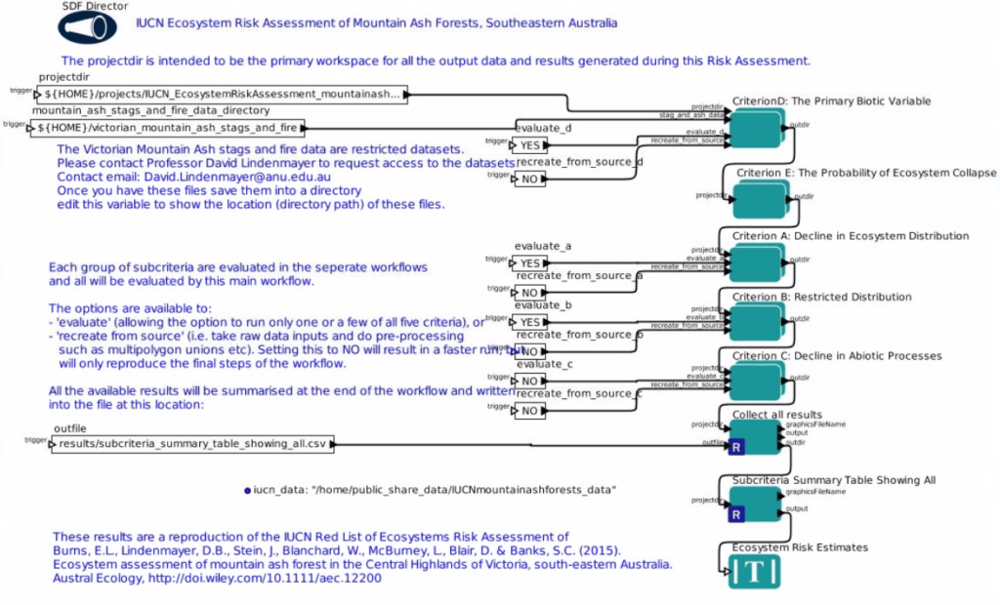
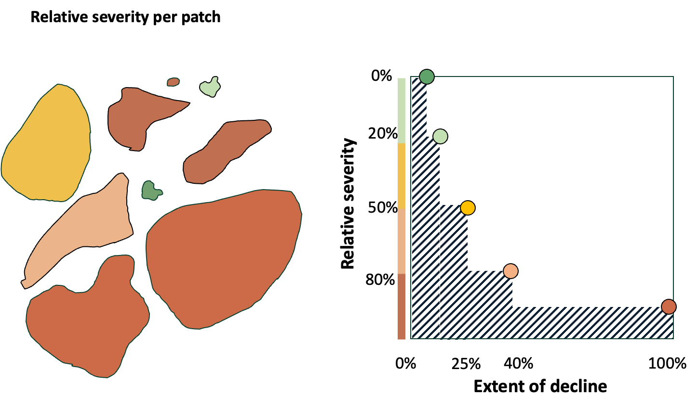
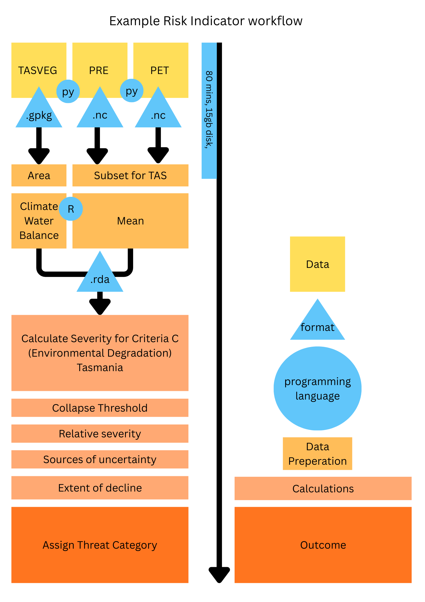
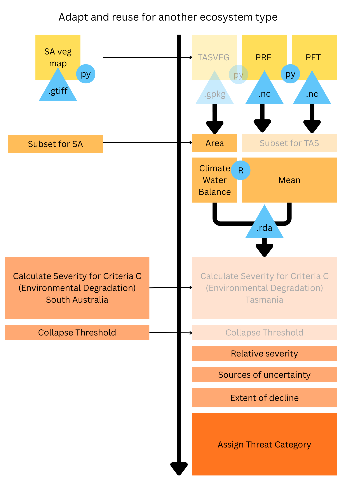
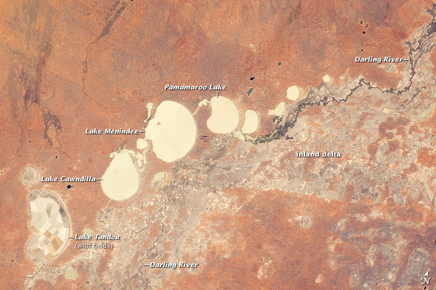
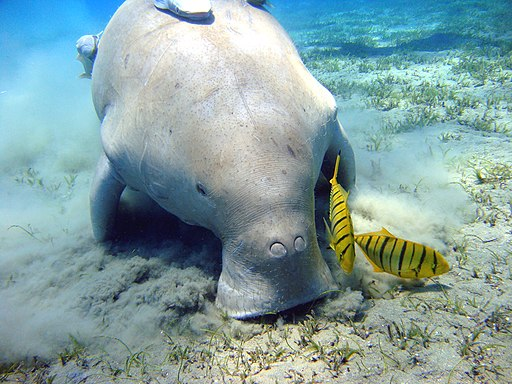
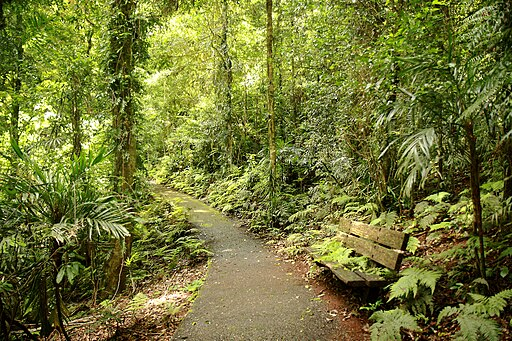

# Project overview {background-image="https://live.staticflickr.com/65535/54677183355_507c3f313d_b.jpg"}

## Ecosystem Indicator Workflows

A modular, fit-for-purpose toolbox that supports the development of ecosystem-specific indicators.

<https://doi.org/10.3565/j5sq-a757>

::: {.r-stretch style="background:#eef7ff; padding:2rem; border-radius:12px;"}

🔧 **Why this project?**


Australia's diverse ecosystems require tailored indicators for monitoring, assessment, and management.

Research infrastructure is critical to accelerate development of indicators for a wide range of Australia’s ecosystems

:::

## 📦 Outcomes

::: {.r-stretch style="background:#f5fff2; padding:2rem; border-radius:12px;"}
🧩 **Core Deliverables**

- Modular workflow toolbox  
- Scalable, adaptable indicator workflows  
- FAIR analysis‑ready datasets  
- Interoperable tools aligned to shared vocabularies  
- A connected and empowered user community  
:::


## Aims & Impacts

A framework for developing fit-for-purpose ecosystem-specific indicators

::: {style="background:#e8fef3; padding:1rem; border-radius:12px;"}
- Design modular, transparent, and reproducible workflow adaptable to:
  - Different datasets  
  - Ecosystem types  
  - Policy and reporting needs  
:::

::: {style="background:#eef1ff; padding:1rem; border-radius:12px;"}
Transparent, defensible, scientifically rigorous indicators
:::


# Reproducible assessments {background-image="https://live.staticflickr.com/8648/16653543556_a498546030_b.jpg" background-color="white" background-opacity="50%"}

##

### Mountain Ash Ecosystem Assessment {.smaller}

IUCN Red List of Ecosystems assessment by @Burns_2015.

:::: {.columns}

::: {.column width="40%"}

<a data-flickr-embed="true" data-header="true" data-footer="true" href="https://www.flickr.com/photos/nicholasjones/16653543556" title="Mountain Ash of the Black Spur Drive"></a><script async src="//embedr.flickr.com/assets/client-code.js" charset="utf-8"></script>

:::

::: {.column width="60%"}

*Key processes*: Vegetation-fire feedbacks, trees as foundation spp for other biota & functions

*Key threats*: Logging & fire regime shift, climate change

:::
::::


## Reproducible workflow {.smaller}


:::: {.columns}

::: {.column width="70%"}



@Guru_2016

:::

::: {.column width="30%"}

::: {.fragment}
Data:

{height=40}

Scripts:

{height=40}


Environment:

CoESRA Desktop

{height=40}

Version control: 

{height=40}

:::
:::

::::
 
# Rerproducible indicator development {background-image="https://live.staticflickr.com/3675/11540276563_11931ea5b1_4k.jpg" background-color="black"}


##  {.smaller}

**Alpine Sphagnum Bog and Associated Fen** in the IUCN Red List of Ecosystems assessment of Australia's Alpine and Subalpine Ecosystems[@Rowland_2026]


```{dot}
//| fig-width: 8.5
//| fig-align: center
//| file: fig/CEM-Alpine-bogs-simple.gv
```


##

::: {.panel-tabset}

### Conceptual model

```{dot}
//| fig-width: 9.5
//| fig-align: center
//| file: fig/CEM-Alpine-bogs-simple-aridity.gv
```

### Indicator design

```{dot}
//| fig-width: 12.5
//| file: fig/Indicator-design-CHELSA.dot
```

### Results



:::


##


:::: {.columns}

::: {.column width="70%"}

{height=660}

:::

::: {.column width="30%"}

::: {.fragment}
Data:

{height=50}
{height=50}

Scripts:

{height=50}
{height=50}

Documentation:

{height=50}
{height=50}

Version control: 




:::
:::

::::
 
## Transparent and reproducible

```{mermaid}
%%| fig-align: center
%%| file: fig/outputs-example-reuse.mmd
%%| fig-responsive: false
```

- FAIR methods and datasets
- Update outputs with new data

# Reusable indicators {background-image="https://live.staticflickr.com/3675/11540276563_11931ea5b1_4k.jpg" background-color="black"}

## Adopt and adapt indicators

```{mermaid}
%%| fig-align: center
%%| file: fig/outputs-example-scale-up.mmd
%%| fig-responsive: false
```

##


:::: {.columns}

::: {.column width="70%"}

{height=660}

:::

::: {.column width="30%"}

::: {.fragment}
Data:

[Enviro Data SA](https://data.environment.sa.gov.au/Pages/default.aspx)
{height=50}

Scripts:

{height=50}
{height=50}

Documentation:

{height=50}
{height=50}

Version control: 



:::

:::

::::
 


##
::: {.panel-tabset}

### F2.5 

F2.5 Ephemeral freshwater lakes, e.g. Menindee Lakes, Lake Cowal, Peery Lake, etc.

:::: {.columns}

::: {.column width="40%"}

<a title="NASA&#039;s Earth Observatory, CC BY 2.0 &lt;https://creativecommons.org/licenses/by/2.0&gt;, via Wikimedia Commons" href="https://commons.wikimedia.org/wiki/File:Menindee_Lakes,_New_South_Wales,_Australia_-_NASA_Earth_Observatory.jpg"></a>

:::

::: {.column width="60%"}

*Key processes*: Water volume-chemistry interactions & trophic web, river inflows, waterbird abundance

*Key threats*: Water extraction, water pollution, eutrophication, climate change

:::

::::

### M1.1

M1.1 Seagrass meadows, e.g. Shark Bay in Western Australia

:::: {.columns}

::: {.column width="40%"}

<a title="Julien Willem, CC BY-SA 3.0 &lt;https://creativecommons.org/licenses/by-sa/3.0&gt;, via Wikimedia Commons" href="https://commons.wikimedia.org/wiki/File:Dugong_Marsa_Alam.jpg"></a>

:::

::: {.column width="60%"}

*Key processes*: Interactions & trophic web, low-energy waves vs. storms, large herbivores

*Key threats*: Sedimentation, eutrophication, climate change

:::

::::

### T1.1 

T1.1 Tropical-subtropical lowland rainforest, e.g. Gondwana rainforests, warm temperate rainforests, ...


:::: {.columns}

::: {.column width="40%"}

<a title="Andrea Schaffer from Sydney, Australia, CC BY 2.0 &lt;https://creativecommons.org/licenses/by/2.0&gt;, via Wikimedia Commons" href="https://commons.wikimedia.org/wiki/File:Gondwana_rainforest_at_Dorrigo_National_Park_(6611254443).jpg"></a>

:::

::: {.column width="60%"}

*Key processes*: Trophic web, gap dynamics, microclimate feedbacks, foundation species

*Key threats*: Climate change, fire regime shifts, invasive species, logging legacies

:::

::::

:::


# Thanks! {background-image="https://live.staticflickr.com/65535/54676036502_07d648f4ab_b.jpg" background-color="black"}


##  {.smaller background-image="https://live.staticflickr.com/65535/54676036502_07d648f4ab_b.jpg" background-opacity="0.3"}

This presentation was prepared by José R. Ferrer-Paris and is shared under license: [Attribution-ShareAlike 4.0 International (CC BY-SA 4.0)](https://creativecommons.org/licenses/by-sa/4.0/deed)

::: panel-tabset
### Links

It was created using  [Quarto](https://quarto.org/docs/presentations/), [Mermaid](https://mermaid.js.org/), [Graphviz](https://graphviz.org/) and [reveal.js](https://revealjs.com/). 

Slides are available at:

[rpubs.com/jrfep](https://rpubs.com/jrfep/ecosystem-indicator-workflows).

Source code available at:

[github/Ecosystem-Indicators-Workflows/](https://github.com/Ecosystem-Indicators-Workflows/project-presentations).

### Images and figures

Photos from:

Wikimedia images: - [Menindee_Lakes, New_South_Wales, Australia - NASA Earth Observatory](https://commons.wikimedia.org/wiki/File:Menindee_Lakes,_New_South_Wales,_Australia_-_NASA_Earth_Observatory.jpg) - [Gondwana rainforest at Dorrigo National Park](https://commons.wikimedia.org/wiki/File:Gondwana_rainforest_at_Dorrigo_National_Park_%286611254443%29.jpg) - [Dugong Marsa Alam](https://commons.wikimedia.org/wiki/File:Dugong_Marsa_Alam.jpg)

Flickr images: - ["Approaching Lake Bill"](https://www.flickr.com/photos/apurdam/11540276563/in/photostream/) by [Andrew Purdam](https://www.flickr.com/photos/apurdam/) - ["Mountain Ash of the Black Spur Drive"](https://www.flickr.com/photos/nicholasjones/16653543556) by [Nicholas Jones](https://www.flickr.com/photos/nicholasjones/) - ["Fuente"](https://flic.kr/p/2riwYLw), and ["La Ruta"](https://flic.kr/p/2riCRFR) by [José Rafael Ferrer-Paris](https://www.flickr.com/photos/199798864@N08/)

Other diagrams created with Graphviz and Mermaid for the ARDC Ecosystem Indicators Workflow project [@ARDC_2026_EIW], with source code shared under the CC BY-SA 4.0 license.

### References

::: {#refs}
:::

:::
